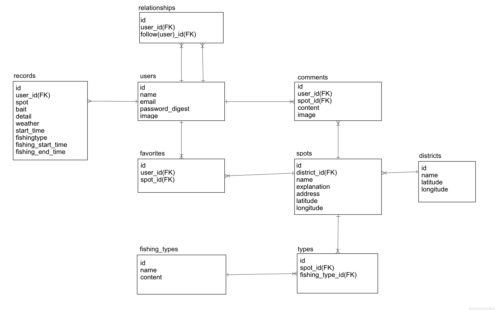

<h2>概要</h2>

大阪釣りスポット
URL：http://osakaturiba.com/

大阪釣りスポットは、大阪の釣り場や釣り方を紹介し、釣果などを共有し合えるサービスで、カレンダーに釣りの予定や記録することもできます。「大阪の釣り場ってどこにあるのかな？」、「釣りの予定を忘れないようにしたい、記録したい」という方におすすめです。

<h3>制作背景</h3>
現在は釣りの技術が発展しており、釣り人が日々増加しています。また、同時に大阪で釣りを始めたばかりの初心者の方も増えています。しかし、大阪のような都会でも釣りができるかどうかわからない、どこで釣りができるかわからないという方も多いと思います。そこで、大阪の釣り場、特に私自身が釣りに行った釣り場を中心に紹介しようと思いました。このサービスを通して、大阪の釣り場を知り、また釣果などを共有し合って、より多くの人方々に釣りの知識を深めてほしいと思います。
また、釣りは行くまでにチェックすることが多いので、カレンダーに少しでも予定を入れたい方のためにもこのサービスを作ろうと思いました。

<h3>工夫した点</h3>

* AWS、Docker、CircleCIの導入、184個のテスト作成
* GoogleMapで地域や釣り場を表示、OpenWeatherMapで天気予報を表示
* JavaScriptを用いた残り文字数の表示など細かい部分も実装
* 個人的な「経験」による釣り場や釣り方の的確な説明
* 釣りや海、川の雰囲気を醸し出す色や背景

<h2>使用技術</h2>

* HTML / CSS
* Javascript
* JQuery
* Bootstrap
* Ruby 2.6.3
* Rails 6.0.3.4
* MySQL 8.0.2.2
* AWS(EC2, VPC, Route53, S3)
* Doker/docker-compose
* Nginx
* Puma
* CircleCI(CI/CD)
* RSpec
* VScode

<h2>機能一覧</h2>

<h3>ユーザー機能</h3>

* ユーザーの新規登録
* プロフィール画像の追加
* ユーザー情報の編集
* ゲストログイン

<h3>フォロー機能</h3>

* ユーザーをフォロー、フォロー解除
* フォロー、フォロワー表示

<h3>googlemap機能</h3>

* 釣り場をgooglemapで表示
* 釣り場詳細ページのピンで住所を表示

<h3>天気予報機能</h3>

* 釣りで重要な天気予報を表示（１日）

<h3>お気に入り機能</h3>

* 釣り場のお気に入り登録
* 釣り場のお気に入り解除
* お気に入りした釣り場の一覧

<h3>検索機能</h3>

* 釣り場、地域の検索
* 検索した釣り場や地域の一覧

<h3>ランキング機能</h3>

* 釣り場のお気に入り数のランキング（１位〜３位まで）

<h3>コメント機能</h3>

* 釣り場コメントの新規投稿
* 釣り場コメントの削除
* コメントの一覧

<h3>釣り方機能</h3>

* 釣り方名とその内容表示
* その釣り方におすすめな釣り場を表示

<h3>フィッシング記録機能</h3>
 
* フィッシング記録の作成、編集、削除
* 自分のフィッシング記録しか表示されない
* 記録した日をカレンダーに表示

<video src="/assets/videos/GIF.mp4" loop autoplay muted></video>

<h3>テスト機能</h3>

+ Rspecによるテスト(example 184)

<h2>インフラ構成図</h2>

<h2>ER図</h2>

